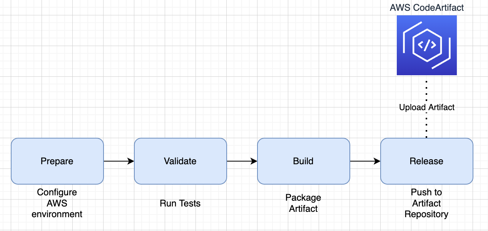
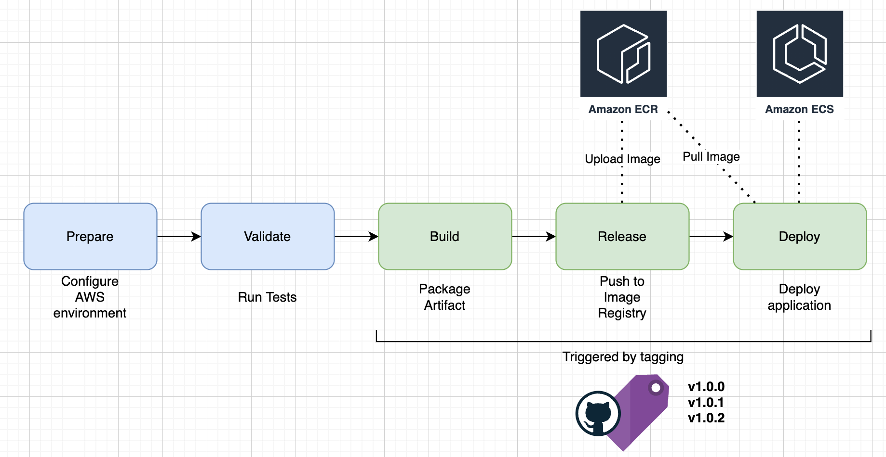

# Picky CICD
This repository contains the assets for Github actions which includes workflows and actions which can be re-used by other projects.

There are two types of workflows currently in this repository:
- build-and-release - for building artifacts and uploading them to an AWS CodeArtifact repository.



- cicd - for creating a docker image, uploading it to AWS ECR and deploying it on AWS ECS



## How to use it
To use a CICD workflow inside your own project, add the following directories and file inside your project at the root path: `.github/workflows/cicd.yml`

```yaml
---
name: {project-name}-cicd

on: [push]

jobs:
  cicd:
    uses: go-picky/picky-microservices/.github/workflows/{workflow-name}.yaml
    with:
      name: {project-name}
    secrets: inherit
```

Note: pick the workflow which is most suitable for the project. They can be found inside this repository under `.github/workflows/`


The workflows require secrets in order to run and access all of the external services outside of GitHub.
Secrets can be configured at the repository level under `https://github.com/{organisation}/{repository-name}/settings/secrets/actions`

The required secrets are:

Workflow:
- gradle-build-and-release
  - `AWS_ACCESS_KEY_ID`
  - `AWS_DOMAIN` - domain that CodeArtifact is hosted on
  - `AWS_SECRET_ACCESS_KEY`
  - `CLUSTER_ARN` - identifier for ECS cluster
- gradle-cicd
  - `AWS_ACCESS_KEY_ID`
  - `AWS_DOMAIN`
  - `AWS_SECRET_ACCESS_KEY`

## Directory structure
```
.
├── .github
│   └── workflows                       (1)
│       └── gradle-build-and-release.yaml
│       └── gradle-cicd.yaml
└── actions                             (2)
    ├── aws                             (3)
    ├── docker                          (4)
    └── gradle                          (5)
```

1. Workflows for different types of projects e.g. Java, Node etc  - see [reusable workflows](https://docs.github.com/en/actions/using-workflows/reusing-workflows) for more information
1. Actions which are referenced by the workflows - see [composite actions](https://docs.github.com/en/actions/creating-actions/creating-a-composite-action) for more information
1. Actions related to AWS operations
1. Actions related to Docker operations
1. Actions related to Gradle operations

## Considerations

### Cluster URL
Currently the deploy stages are hardcoded to deploy to the development cluster of ECS and a placeholder registry on ECR.
This will need to be changed once we are ready to use this CICD for production deploys or when we have a proper development envioronment for testing.

### Upload Limits
Github imposes an upload limit on the output artifacts for jobs. As a workaround, the the build and release jobs have been combined into one stage. This should be more gracefully moving forward.
